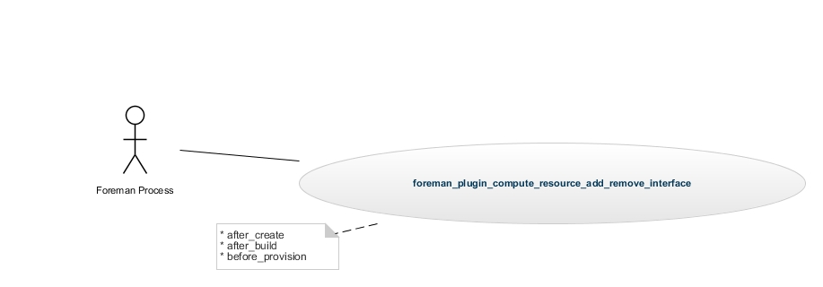
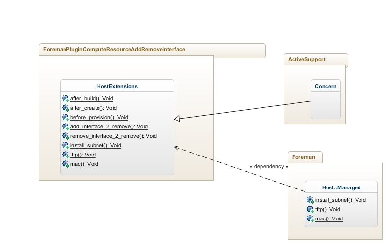

# ForemanPluginComputeresourceAddRemoveInterface

Adds or removes a given interface to a VMware guest when build and removes it afterwards.

# Installation:

Just download the gem file or build it from source:

```gem build foreman_plugin_compute_resource_add_remove_interface.gemspec```

Then install the plugin by adding it to foreman

```gem install foreman_plugin_compute_resource_add_remove_interface```

and add it to the bundle environment:
```echo 'gem "foreman_plugin_compute_resource_add_remove_interface"' > bundle.d/foreman_plugin_compute_resource_add_remove_interface.rb```

Then bundle update.

```bundle update```

# Usage

Now enable the plugin in the foreman settings.yaml file and specify a command to be called e.g.:
```
cat >>config/settings.yaml << EOF 
:pluginComputeresourceAddRemoveInterface:
  :enabled: true
  :forcePowerOff: true
  :restorePowerState: true
  :installSubnet: "Install"
  :vsphere:
     :remove:
        :network: "gallien"
        :type: "VirtualVmxnet3"
        :name: "Netzwerkadapter 3"
     :add:
        :network: "gallien"
        :type: "VirtualVmxnet3"        
```

The vsphere section defines the default action this plugin should do when triggered.

For adding in this case a new fog hash as defined by this yaml is passed to the machine in question. It will add a new NIC to the guest.

When called for removement again the hash under the remove section will be passed to the fog guest in order to detect the NIC to delete.

The parameter forcePowerOff will force the power off if the machine is running.

The parameter restorePowerState will restore the power state of the machine. Means if it had to be switched off it will be reswitched on again.

The add and remove settings can be overwritten on a per host group bases.

Just define the following parameters with new ruby hashes as above and they will be used:

* compute_resource_add_remove_interface_add: the ruby hash for a fog NIC to be added.
* compute_resource_add_remove_interface_remove: the ruby hash for a fog NIC to be removed.

# Source Code

## UML Documentation

### Use Case

This image describes the current use case how foreman calls this plugin.
Also see: [Foreman Template Writing](http://projects.theforeman.org/projects/1/wiki/TemplateWriting)


### Class Diagram



Basically the plugin consists of one class that corresponds to one file:

app/models/foreman\_plugin\_compute\_resource\_add\_remove\_interface/host\_extension.rb

In host_extension.rb the callbacks are defined that are being called for the following events:

* after_create points to add_interface_2remove
* after_build points to add_interface_2remove
* before_provision points to remove_interface_2remove

# Copyright

[Update copyright accordingly.  GPLv3 is used as Foreman itself is.]

Copyright (c) 2012-2013 Red Hat Inc.

This program is free software: you can redistribute it and/or modify
it under the terms of the GNU General Public License as published by
the Free Software Foundation, either version 3 of the License, or
(at your option) any later version.

This program is distributed in the hope that it will be useful,
but WITHOUT ANY WARRANTY; without even the implied warranty of
MERCHANTABILITY or FITNESS FOR A PARTICULAR PURPOSE.  See the
GNU General Public License for more details.

You should have received a copy of the GNU General Public License
along with this program.  If not, see <http://www.gnu.org/licenses/>.
